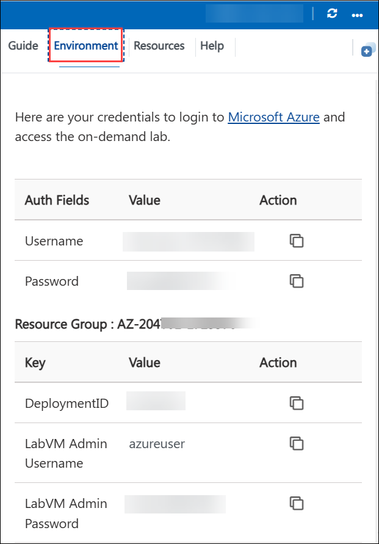
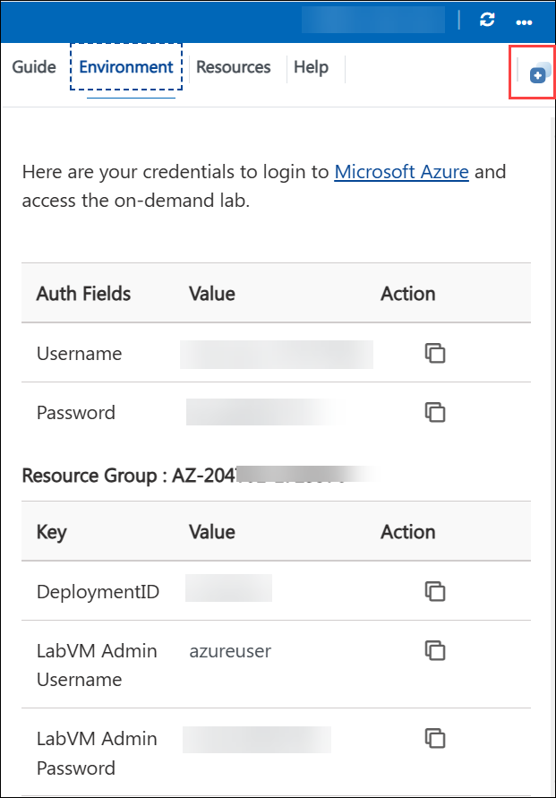
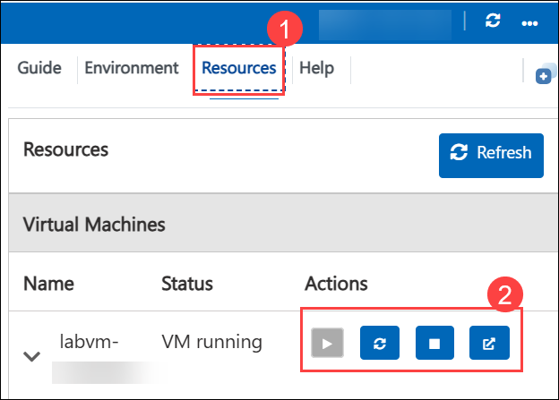
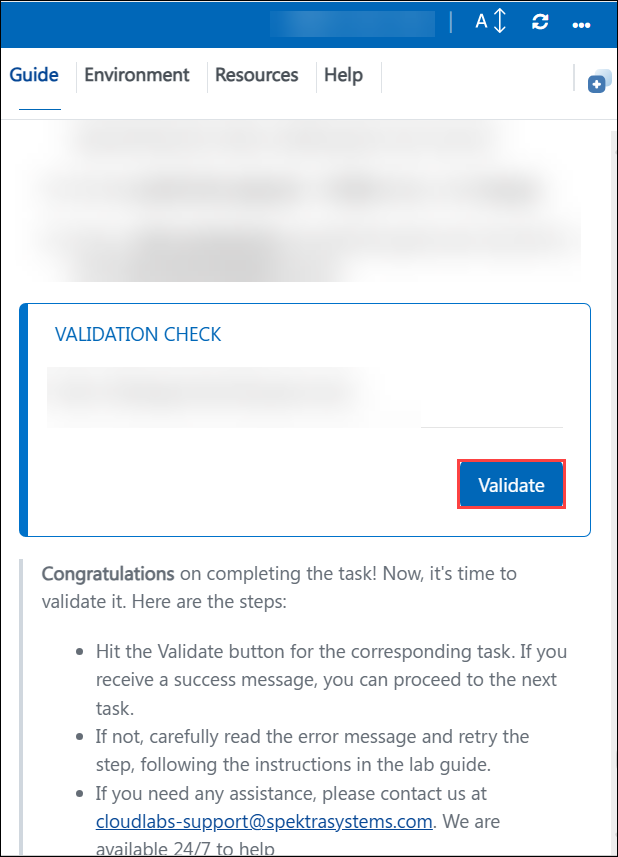
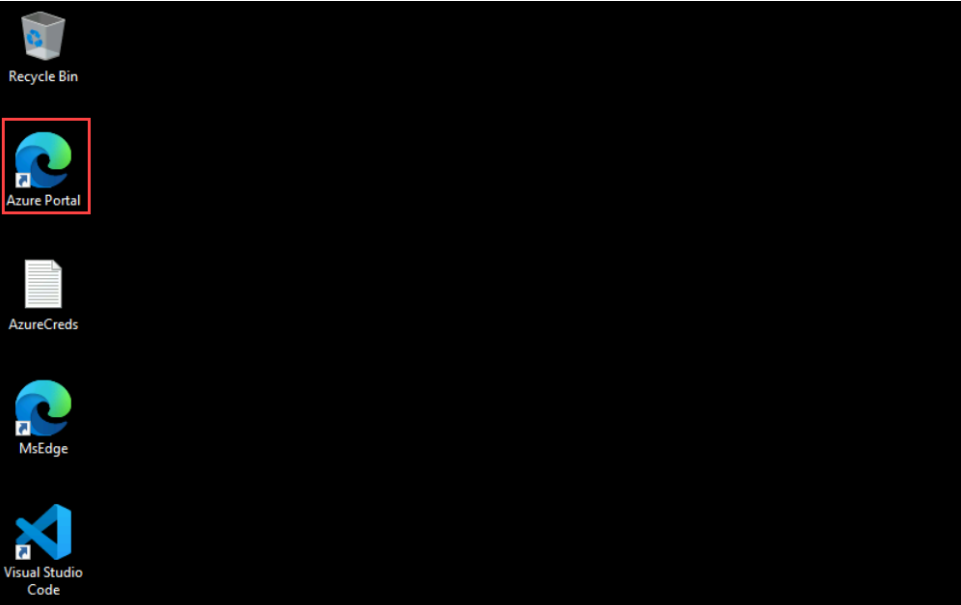
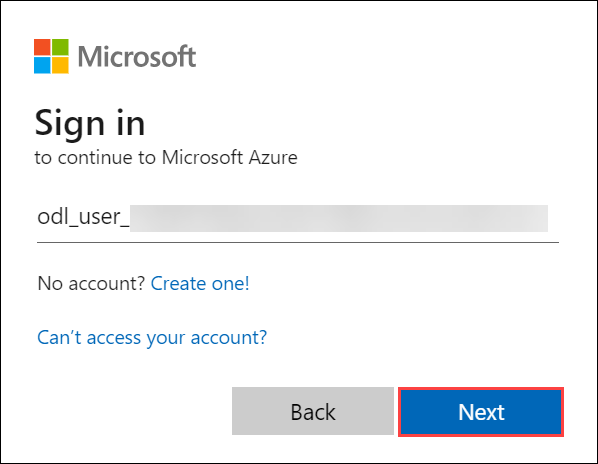
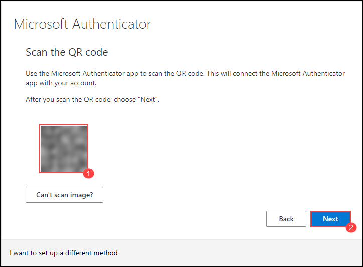
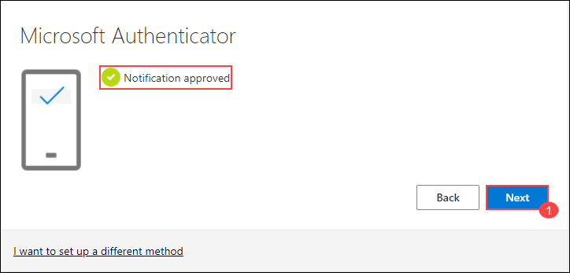

# AZ204: Developing Solutions for Microsoft Azure

Welcome to your AZ-204-: Developing Solutions for Microsoft Azure Workshop! We've prepared a seamless environment for you to explore and learn Azure Services. Let's begin by making the most of this experience.

## Lab 01: Build a web application on Azure platform as a service offering

### Overall Estimated timing: 60 minutes

## Overview

In this hands-on lab, you’ll gain practical experience in building and deploying a web application on Azure using the Platform as a Service (PaaS) model. You will begin by creating a web application hosted on Azure App Service, a fully managed web hosting platform. Next, you’ll learn how to deploy existing web application files using the Apache Kudu zip deployment method, enabling streamlined and efficient file uploads. Finally, you’ll verify the deployment by viewing and testing the live web application. By the end of this lab, you’ll be equipped with the foundational skills to deploy and manage web applications in Azure using PaaS offerings.

## Objectives

By the end of this lab, you will be able to build and deploy a full-stack web application on Azure using Azure Storage and the Web Apps feature of Azure App Service.

+ Exercise 1: Build a backend API by using Azure Storage and the Web Apps feature of Azure App Service: In this exercise, participants will learn how to create and configure a web app in Azure and deploy a backend ASP.NET application using the Azure CLI and the Apache Kudu zip deployment utility. This includes setting up the Web Apps feature of Azure App Service and integrating it with Azure Storage to enable backend functionality.

+ Exercise 2: Build a front-end web application by using Azure Web Apps: In this exercise, participants will learn how to create an Azure Web App and deploy the front-end code of an existing web application to the cloud. This includes provisioning the web app resource and using deployment tools to host the application on Azure’s PaaS environment.

## Pre-requisites

- A basic understanding of web application architecture (frontend and backend components).
- Familiarity with ASP.NET web applications and core development concepts.
- Basic knowledge of command-line tools and zip file handling.

## Architecture

In this hands-on lab, the architecture flow includes several essential components.

1. Build a backend API by using Azure Storage and the Web Apps feature of Azure App Service: Learning how to create and configure a web app in Azure, deploy a backend ASP.NET application using the Azure CLI and Apache Kudu zip deployment utility, and integrate the application with Azure Storage to enable backend functionality using the Web Apps feature of Azure App Service.

1. Build a front-end web application by using Azure Web Apps: Learning how to create an Azure Web App and deploy the front-end code of an existing web application to the cloud, including provisioning the web app resource and using deployment tools to host the application on Azure’s PaaS environment.

## Architecture Diagram

## Explanation of Components

1. Azure App Service: Azure App Service is a fully managed Platform as a Service (PaaS) offering from Microsoft that enables developers to build, deploy, and scale web apps and APIs quickly. It supports multiple programming languages and frameworks, including .NET, Java, Node.js, and Python, and integrates easily with other Azure services.

1. Azure Web Apps: Azure Web Apps is a feature within Azure App Service that provides a scalable hosting environment for web applications. It allows developers to deploy web apps using various deployment methods and manage them through the Azure portal, CLI, or DevOps pipelines.

1. Azure Storage: Azure Storage is Microsoft’s cloud storage solution for modern data storage scenarios. It offers scalable, durable, and secure storage for a variety of data types including blobs, files, queues, and tables. In this lab, it is used to support backend functionality for the deployed API.

# Getting Started with the Lab
 
Welcome to your AZ-204-: Developing Solutions for Microsoft Azure workshop! We've prepared a seamless environment for you to explore and learn Azure Services. Let's begin by making the most of this experience:
 
## Accessing Your Lab Environment
 
Once you're ready to dive in, your virtual machine and lab guide will be right at your fingertips within your web browser.
 

### Virtual Machine & Lab Guide
 
Your virtual machine is your workhorse throughout the workshop. The lab guide is your roadmap to success.
 
## Exploring Your Lab Resources
 
To get a better understanding of your lab resources and credentials, navigate to the **Environment** tab.
 

 
## Utilizing the Split Window Feature
 
For convenience, you can open the lab guide in a separate window by selecting the **Split Window** button from the top right corner.
 

 
## Utilizing the Zoom In/Out Feature

To adjust the zoom level for the environment page, click the A↕ : 100% icon located next to the timer in the lab environment.

## Managing Your Virtual Machine
 
Feel free to **start, stop, or restart (1)** your virtual machine as needed from the **Resources (2)** tab. Your experience is in your hands!
 

## **Lab Duration Extension**

1. To extend the duration of the lab, kindly click the **Hourglass** icon in the top right corner of the lab environment. 

    

    >**Note:** You will get the **Hourglass** icon when 10 minutes are remaining in the lab.

2. Click **OK** to extend your lab duration.
 
   

3. If you have not extended the duration prior to when the lab is about to end, a pop-up will appear, giving you the option to extend. Click **OK** to proceed.

 ### Lab Validation

1. After completing the task, hit the **Validate** button under the Validation tab integrated into your lab guide. You can proceed to the next task if you receive a success message. If not, carefully read the error message and retry the step, following the instructions in the lab guide.

   

1. If you need any assistance, please contact us at cloudlabs-support@spektrasystems.com.

## Let's Get Started with Azure Portal

1. On your virtual machine, click on the **Azure Portal** icon as shown below:

   
   
1. You will see the **Sign in to the Microsoft Azure** tab. Here, enter your credentials:
 
   - **Email/Username:** <inject key="AzureAdUserEmail"></inject>
 
       
 
1. Next, provide your password:
 
   - **Password:** <inject key="AzureAdUserPassword"></inject>
 
       

1. If you see the pop-up **Stay Signed in?**, click **No**.       

1. If an **Action required** pop-up window appears, click on **Ask later**.

   
    
1. If prompted to stay signed in, you can click **No**.
 
### Steps to Proceed with MFA Setup if the "Ask Later" Option is Not Visible

1. If you see the pop-up **Stay Signed in?**, click **No**.

1. If **Action required** pop-up window appears, click on **Next**.
   
   

1. On **Start by getting the app** page, click on **Next**.
1. Click on **Next** twice.
1. In **android**, go to the play store and Search for **Microsoft Authenticator** and Tap on **Install**.

   

   > Note: For Ios, Open the app store and repeat the steps.

   > Note: Skip if already installed.

1. Open the app and tap on **Scan a QR code**.

1. Scan the QR code visible on the screen **(1)** and click on **Next (2)**.

   

1. Enter the digit displayed on the Screen in the Authenticator app on mobile and tap on **Yes**.

1. Once the notification is approved, click on **Next**.

   

1. Click on **Done**.

1. If prompted to stay signed in, you can click **"No"**.

1. Tap on **Finish** in the Mobile Device.

   > NOTE: While logging in again, enter the digits displayed on the screen in the **Authenticator app** and click on Yes.

1. If a **Welcome to Microsoft Azure** pop-up window appears, simply click **"Cancel"** to skip the tour.

1. If you see the pop-up **You have free Azure Advisor recommendations!**, close the window to continue the lab.

## Support Contact
 
The CloudLabs support team is available 24/7, 365 days a year, via email and live chat to ensure seamless assistance at any time. We offer dedicated support channels explicitly tailored for both learners and instructors, ensuring that all your needs are promptly and efficiently addressed.
 
Learner Support Contacts:
 
- Email Support: cloudlabs-support@spektrasystems.com
- Live Chat Support: https://cloudlabs.ai/labs-support

Click on **Next** from the lower right corner to move on to the next page.

   

## Happy Learning !!   

